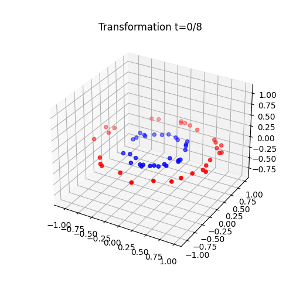
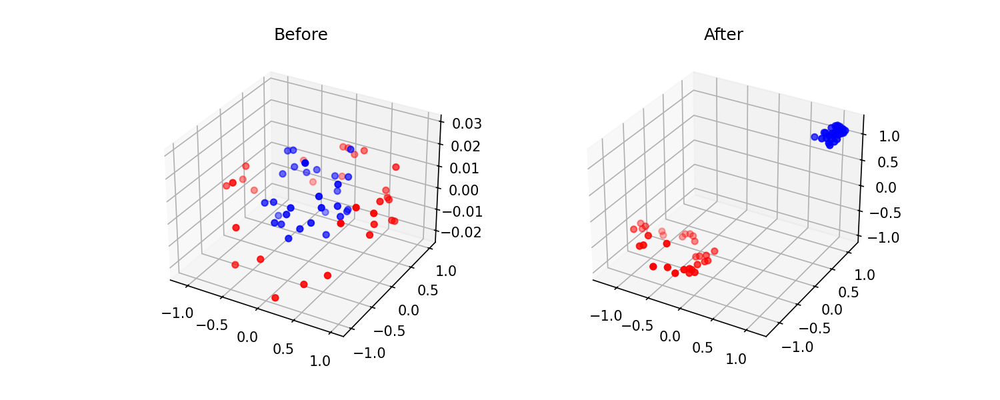
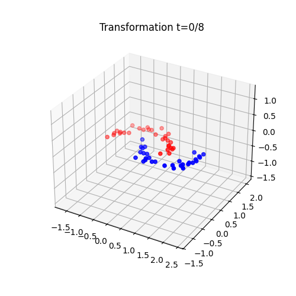
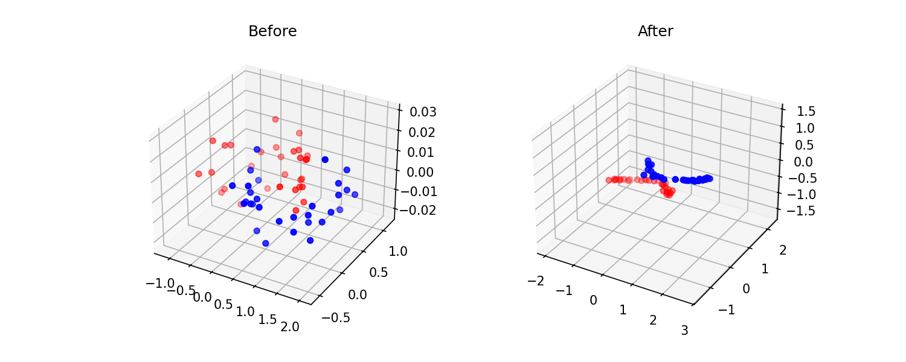
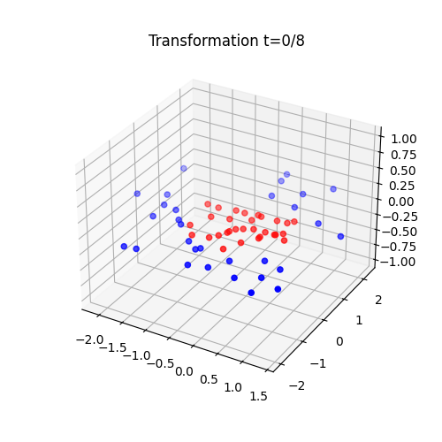
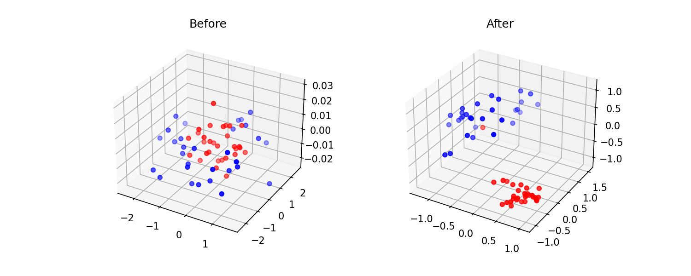
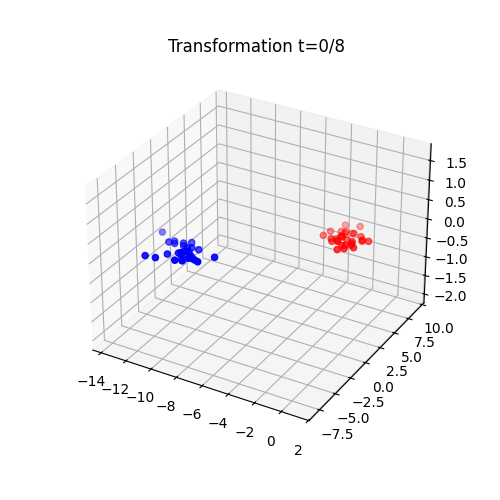
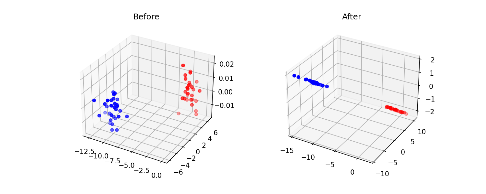

# Diffeomorphic Learning for Nonlinear Classification 🚀

Welcome to the **Diffeomorphic Learning Showcase**! This repository explores an elegant alternative to the *"black-box"* mechanics of standard Deep Neural Networks. Originally grounded in mathematical shape analysis and optimal transport, this project implements a continuous **dynamic geometric flow** that elegantly transforms non-separable datasets into linearly separable topologies.

---

## 📖 Overview
Instead of cascading through discrete linear matrix layers and non-linear activation functions (like an MLP), Diffeomorphic Learning trains a smooth, time-dependent, and topology-preserving velocity field $v(t, \cdot)$. 

It essentially moves all points dynamically through physical space like a fluid, guaranteeing no spaces are torn or folded. A simple terminal classifier (e.g., Logistic Regression) acts at the final time $t=1$. 

### The Core Geometric Tricks Used:
1. **The Dummy Dimension (Lifting)**: Strictly 2D diffeomorphisms cannot break closed topological barriers (like a circle surrounded by a ring). We resolve this structural limitation by injecting a single $d+1$ dummy dimension, effectively letting the velocity field "lift" points over the barrier!
2. **Affine Extensions ($g$)**: Pure scalar RBF kernels (RKHS) vanish at infinity and struggle with global rigid transformations space-wide. We explicitly bundle an affine vector subspace mapping (translation and rotation components, structured as $g(t, x) = A(t)x + b(t)$), drastically improving expressivity.

---

## 🛠️ Codebase & PyTorch Engine
We shifted the traditional heavy Euler discretization of PMP backward systems into an accessible, end-to-end **PyTorch Autograd Implementation**. 

You'll find the core elements inside the `/code` directory:
- 📓 **`code/Diffeomorphic_Learning_pytorch.ipynb`**: The foundational notebook setting up the architecture `DiffeomorphicLearnerTorch(nn.Module)`. It successfully tackles robust multi-dimensional sets against baseline models, mapping gradients over finite spatial steps automatically!
- 🐍 **`code/generate_best_seed_visualizations.py`**: A helper script utilized to run our PyTorch modules through structured datasets (`circles`, `moons`, `blobs`, `gaussian_quantiles`), yielding precision extraction visualizations.

---

## 🌠 Visualizing the Deformation Flow

Below are the dynamically computed flows extracting elements out of their initial intertwined layouts into separable shapes using Diffeomorphic tracking. Look at how seamlessly the geometric boundaries bend!

### 🔴🔵 1. Circles Dataset
The classic locked ring topological barrier. The algorithm naturally utilizes the dummy dimension to float the interior out.
> **Evolution Flow**

> **Static States (Before vs After)**

 

### 🌙 2. Moons Dataset
Bending dense intersecting segments linearly sideways.
> **Evolution Flow**

> **Static States (Before vs After)**

 

### 🟢 3. Gaussian Quantiles
Massively outperforming naive regression models on dense concentric structures! 
> **Evolution Flow**

> **Static States (Before vs After)**

 

### ☁️ 4. Blobs Dataset
> **Evolution Flow**

> **Static States (Before vs After)**

---

## 📚 Final Presentation Insight
I have aggregated all the mathematical framework and final results in a well-polished slide deck encompassing the geometric setup, topological analysis, scalability benchmarks ($O(N^2)$ control point reductions) and evaluation parameters. 
View the fully compiled presentation here: **[`final_presentation.pdf`](final_presentation.pdf)**. 
